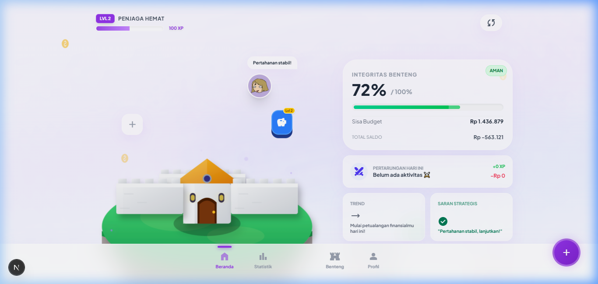

<div align="center">
  <!-- BANNER -->
  
  
  <h1>🛡️ MyDuit Quest ⚔️</h1>
  <p><b>Aplikasi Pencatat Keuangan Gamifikasi Paling Mutakhir dengan Kecerdasan Buatan (AI)</b></p>
  <p><i>Ubah kebiasaan finansialmu dari membosankan menjadi petualangan RPG yang epik!</i></p>
  
  <p>
    <b>🔥 Coba Web-nya Sekarang:</b><br/>
    <a href="https://myduit-quest.vercel.app/" target="_blank">👉 <b>https://myduit-quest.vercel.app/</b> 👈</a>
  </p>

  <p>
    <a href="#-masalah-solusi">Masalah & Solusi</a> •
    <a href="#-fitur-unggulan">Fitur Unggulan</a> •
    <a href="#-kompetitor-vs-myduit-quest">Vs Kompetitor</a> •
    <a href="#-myduit-quest-pro-">Pro Plan</a> •
    <a href="#-teknologi">Teknologi</a> •
    <a href="#-mulai-petualangan">Mulai</a>
  </p>

  <p>
    
    
    
    
    
    
  </p>
</div>

---

## 🛑 Masalah Keuangan Modern

Mencari pelacak keuangan (*expense tracker*) itu gampang. Tapi **konsisten** mencatat pengeluaran setiap hari? Itu masalah besar.
Kebanyakan orang gagal memantau keuangan mereka karena beberapa alasan krusial:
1. **Membosankan:** Rasanya seperti bekerja sebagai akuntan di tabel Excel.
2. **Melelahkan:** Mengetik manual nama barang dan harga dari struk belanja super panjang sangat menyiksa.
3. **Lupa:** Sibuk beraktivitas membuat kita sering absen mencatat, lalu akhirnya data tidak akurat dan kita menyerah.
4. **Tanpa Reward:** Tidak ada penghargaan yang memicu dopamin ketika kita berhemat atau berhasil mencapai target anggaran.

## 💡 Solusi: MyDuit Quest

**MyDuit Quest** mendobrak batasan aplikasi keuangan tradisional! Kami menggabungkan **manajemen keuangan, elemen RPG (Role-Playing Game), dan AI (Artificial Intelligence)** menjadi satu pengalaman yang adiktif dan positif.

Anggaran bulananmu adalah *Health Points* (HP) sebuah Benteng. Catat transaksi untuk melindungi bentengmu dari serangan "pengeluaran", kembangkan avatarmu, kumpulkan *Experience* (XP), naik level, buka dekorasi unik, dan pamerkan pencapaianmu! Semuanya dilakukan secara instan dengan bantuan robot AI, dan kamu tidak akan pernah lupa berkat pengingat cerdas PWA.

---

## ✨ Fitur Unggulan

<div align="center">
  
</div>

### 🤖 1. Scan Struk Instan dengan AI (Powered by Gemini)
Malas mengetik? Cukup foto struk belanja minimarket atau restoranmu! AI *Computer Vision* kami (Google Gemini 2.5) otomatis mengekstrak **Total Harga** dan merekomendasikan **Kategori**, memangkas waktu input data hingga 90%!

### 🏰 2. Visualisasi Benteng 3D & RPG Leveling
Uang bukan lagi sekadar angka di grafik, uangmu adalah **Darah (HP) Bentengmu**. 
- Pengeluaran mengurangi HP Benteng.
- Catat transaksi memberikan **XP** & memperpanjang rentetan hari (**Streak**).
- Naik level untuk membuka kustomisasi dekorasi visual benteng (bendera, kastil, meriam).

### 🔔 3. Daily Push Notifications (Service Worker)
Ucapkan selamat tinggal pada "lupa mencatat". MyDuit Quest memiliki fitur PWA Service Worker yang bisa mengirim **Notifikasi Pengingat** langsung ke HP/Laptomu setiap jam 20:00, lengkap dengan tombol instan untuk langsung menuju form pencatatan!

### 📊 4. Sub-Budget & Strategi Ransum (Kustom Alokasi)
Gunakan taktik finansial seperti 50/30/20 (Kebutuhan/Hiburan/Tabungan) dengan fitur alokasi sub-budget. Kelompokkan transaksimu untuk memantau sisa uang spesifik setiap pos anggaran dengan visual bar yang mulus.

### 🏆 5. Sistem Medali (Achievements)
Kamu hemat? Mampu menjaga streak 7 hari beruntun? Kamu akan dianugerahi gelar dan medali pencapaian (*Achievements*) digital. Gamifikasi sejati!

### 💾 6. Backup, Export, dan Cloud Sync
Datamu aman, selamanya.
- **Ekspor Data:** *Download* catatan transaksimu ke Excel (CSV) atau format mentah (JSON).
- **Cloud Sync:** Didukung Supabase, sinkronisasi *real-time* ke cloud agar data tidak hilang ketika berpindah perangkat. Login ultra aman tanpa *password* menggunakan **Magic Link**.

---

## 👑 MyDuit Quest PRO!

Kami menyediakan sistem langganan Premium (pembayaran terintegrasi via **Mayar**) yang memberikan *power up* finansial bagi para "Pro Komandan":

| Fitur | 🛡️ Free Player | 👑 PRO Komandan |
| :--- | :--- | :--- |
| **Scan AI Struk** | Maksimal 30x / Bulan | **Unlimited** (Tak Terbatas) ⚡ |
| **Kustomisasi Alokasi**| Hanya 2 preset (*classic/student*) | **Bebas custom** % alokasi sendiri 🎛️ |
| **Dekorasi Benteng** | Terkunci berdasarkan Level akun | **Unlock Semua Mode** sejak awal! 🏰 |
| **Pilihan Avatar** | 4 Standar | **Avatar Premium** Spesial (Knight, dll) 🥷 |
| **Ekspor Data (Excel)**| 🔒 Terkunci | **Unlocked** (Download CSV) 📊 |
| **Simbol Kebanggaan** | Reguler | **Badge "PRO" Emas** di Profile 😎 |
| **Pembayaran** | Gratis | **Sekali Bayar Akses Selamanya!** 💳 |

---

## 🥊 Kompetitor vs MyDuit Quest

| Aspek | Aplikasi Keuangan Biasa | 🛡️ MyDuit Quest |
| :--- | :--- | :--- |
| **Input Data** | Mengetik manual, input kategori rumit. | ✨ Hanya foto struk dengan AI Gemini! |
| **Desain UI/UX** | Kaku, penuh tabel, warna membosankan. | 🎨 Premium Glassmorphism, *Dark Mode*, Framer Motion 60fps! |
| **Motivasi User** | Grafik garis statis. | 🏰 Benteng 3D HP Bar, XP, Level, & Notifikasi PWA Push. |
| **Edukasi Alokasi**| Fitur sub-wallet sering berbayar mahal bulanan. | 💼 Sistem Strategi Ransum (50/30/20) terintegrasi ciamik. |

---

## 🛠️ Teknologi & Stack

Aplikasi ini mendemonstrasikan keandalan *web architecture* paling mutakhir:

- **Framework:** Next.js 16.1 (App Router), React 19, TypeScript
- **State Management:** Zustand (dengan Persist layer untuk kecepatan Local-First)
- **Styling & Animasi:** Tailwind CSS v4, Framer Motion
- **Infras & Database:** Supabase (Auth, DB Sync, RLS Security)
- **AI Engine:** Google Gemini SDK (`@google/genai`) 
- **Payment Gateway:** Mayar Headless API / Webhooks
- **Progressive Web App:** Service Worker Notification API

---

## 🚀 Instalasi & Mulai Petualangan Lokal

Siap melindungi finansialmu sebagai Developer? Gas compile source kodenya!

### Prasyarat
- Node.js 18.x+, npm / yarn / pnpm
- [Supabase](https://supabase.com) (Untuk Cloud Token Auth)
- API Key [Google Gemini](https://aistudio.google.com/app/apikey)
- Kredensial API [Mayar](https://mayar.id) (Opsional untuk fitur upgrade Pro lokal)

### Mulai Compile

1. **Clone repository sakti ini**
   ```bash
   git clone https://github.com/ardians45/myduit-quest.git
   cd myduit-quest
   ```

2. **Install Semua Dependencies**
   ```bash
   npm install
   ```

3. **Konfigurasi Environment (.env.local)**
   Panggil arwah env dengan membuat `.env.local` di *root* dan masukkan API rahasiamu:
   ```env
   # Database & Auth
   NEXT_PUBLIC_SUPABASE_URL=your_supabase_url
   NEXT_PUBLIC_SUPABASE_ANON_KEY=your_supabase_anon_key
   
   # AI Scanner
   GEMINI_API_KEY=your_gemini_api_key

   # Payment Gateway (Optional - for Pro feature local testing)
   MAYAR_API_KEY=your_mayar_key
   MAYAR_BASE_URL=https://api.mayar.club/v1
   MAYAR_WEBHOOK_SECRET=your_mayar_webhook_secret
   ```

4. **Jalankan Quest!**
   ```bash
   npm run dev
   ```
   **Buka `http://localhost:3000` dan mulailah membangun benteng epikmu! 🏰🔥**

---

<div align="center">
  Dibuat dengan ❤️, ☕, dan ✨ AI untuk mengubah cara dunia menabung.<br/>
  <b>⚔️ Time to Level Up Your Finance! ⚔️</b>
</div>
